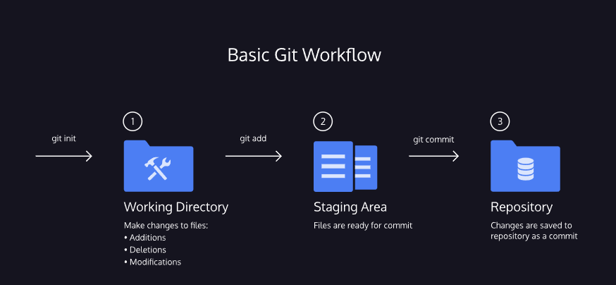

# Basic GIT workflow

The Git workflow consists of editing files in the working directory, adding files to the staging area, and saving changes to a Git repository

1. **git init:** 

The word **init** means initialize. The command sets up all the tools Git needs to begin tracking changes made to the project.

2. **git status:**

you will be changing the contents of the working directory. You can check the status of those changes

3. **git add:**

Add the changes to the staging area before commmit to the repository

4. **git commit:**

A commit permanently stores changes from the staging area inside the repository.

5. **git log:**

Refer back to an earlier version of a project. Commits are stored chronologically in the repository and can be viewed

In the output, notice:

- A 40-character code, called a **SHA**, that uniquely identifies the commit. This appears in orange text